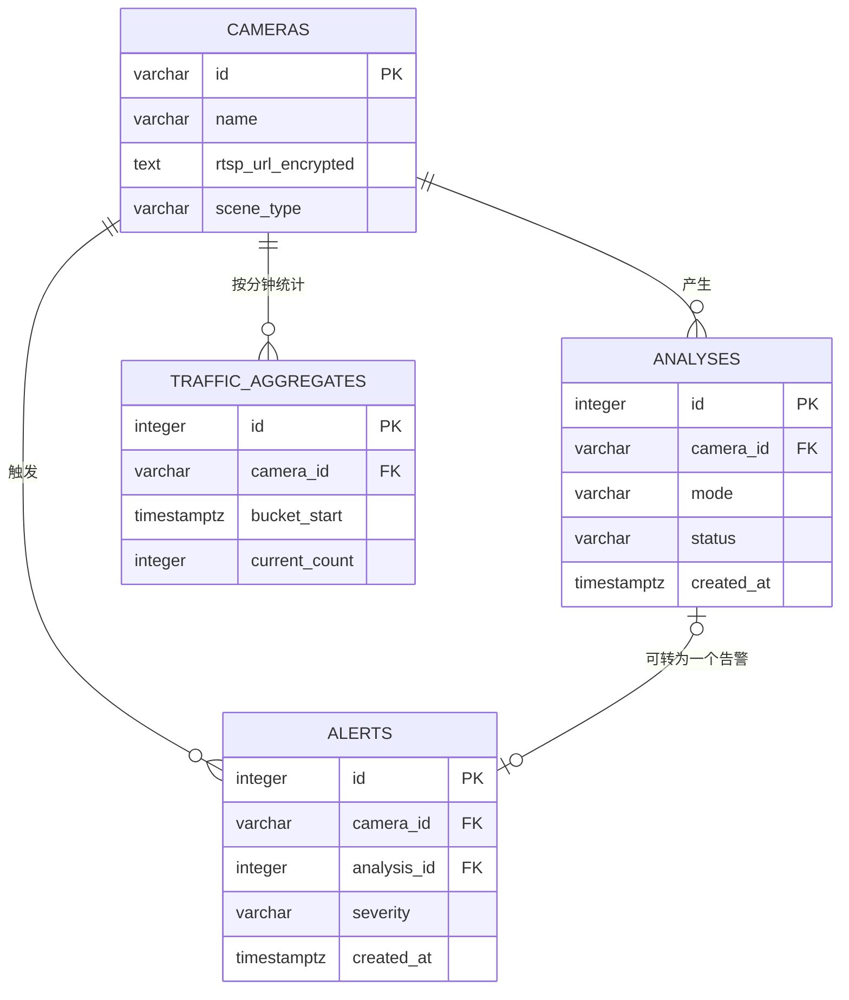

# AIVideo2.0 数据库设计方案

## 1. 文档说明

本文档描述 AIVideo2.0 智能视频巡检平台的数据库设计，依据当前后端 SQLAlchemy 模型、Alembic 迁移、接口参数和检测业务流程整理，可作为开发、测试、部署、数据运维和后续数据库演进的统一依据。

- 数据库：PostgreSQL 17
- 数据库名：`monitor`
- ORM：SQLAlchemy 2.x
- 迁移工具：Alembic
- 时间标准：数据库统一保存带时区的 UTC 时间，接口输出 ISO 8601；排班判断使用摄像头配置的业务时区，默认 `Asia/Shanghai`
- 当前表数量：9 张
- 主键策略：业务实体 `cameras` 使用可读字符串主键；流水表使用自增整数；全局配置表使用固定主键 `id = 1`

## 2. 设计目标

1. 支持 96 路摄像头的低频周期抓帧和多模式巡检。
2. 完整保存“摄像头配置—分析结果—业务告警—证据文件”的追溯链路。
3. 支持分钟级人流统计和首页聚合查询。
4. RTSP 密码、VLM API Key 和 Webhook 密钥只保存密文。
5. 摄像头业务编号修改时保留历史数据，删除摄像头时清理其业务数据。
6. 高频流水表和低频配置表分离，便于后续分区、归档和扩容。

## 3. 表清单

| 表名 | 中文名 | 类型 | 主要用途 |
| --- | --- | --- | --- |
| `cameras` | 摄像头 | 核心主数据 | 视频源、检测模式、区域、排班、检测阈值及运行状态 |
| `analyses` | 分析记录 | 流水数据 | 每次检测模式的判断结果、模型、耗时和证据信息 |
| `alerts` | 告警记录 | 业务流水 | 从已确认分析中产生的告警及 Webhook 投递状态 |
| `traffic_aggregates` | 人流分钟聚合 | 统计流水 | 每个摄像头每分钟的在场、进入和离开人数 |
| `model_settings` | 视觉大模型配置 | 全局单例配置 | VLM 服务地址、模型名称和加密 API Key |
| `webhook_settings` | Webhook 配置 | 全局单例配置 | 告警回调地址、开关和加密签名密钥 |
| `detector_settings` | 本地检测器配置 | 全局单例配置 | 通用 YOLO、烟火模型、设备、哈希和许可证信息 |
| `retention_settings` | 数据保留配置 | 全局单例配置 | 告警保留天数及自动清理开关 |
| `display_settings` | 页面显示配置 | 全局单例配置 | 人流报表和当前在场人数的显示开关 |

## 4. 实体关系



关系和级联规则如下：

| 父表 | 子表 | 基数 | 外键 | 更新规则 | 删除规则 |
| --- | --- | --- | --- | --- | --- |
| `cameras` | `analyses` | 1:N | `analyses.camera_id → cameras.id` | `ON UPDATE CASCADE` | `ON DELETE CASCADE` |
| `cameras` | `alerts` | 1:N | `alerts.camera_id → cameras.id` | `ON UPDATE CASCADE` | `ON DELETE CASCADE` |
| `cameras` | `traffic_aggregates` | 1:N | `traffic_aggregates.camera_id → cameras.id` | `ON UPDATE CASCADE` | `ON DELETE CASCADE` |
| `analyses` | `alerts` | 1:0..1（业务约定） | `alerts.analysis_id → analyses.id` | 默认限制 | `ON DELETE SET NULL` |

说明：

- 修改摄像头业务编号时，三张子表的 `camera_id` 自动同步，历史不会断链。
- 删除摄像头属于强删除，会级联删除分析、告警和人流数据；执行前应由接口进行二次确认或先做归档。
- 删除或归档分析记录时，告警仍保留，只把 `alerts.analysis_id` 置空；告警表自身保存了模式、置信度、原因和证据快照，仍可独立展示。
- 当前数据库没有为 `alerts.analysis_id` 设置唯一约束，因此“一条分析最多生成一条告警”由业务代码保证；建议补充唯一索引，见第 9 节。
- 5 张全局配置表互相无外键，均通过固定 `id = 1` 表示当前系统唯一配置。

## 5. 表结构详细设计

### 5.1 `cameras` 摄像头表

摄像头是系统核心主数据，同时保存用户配置和近期运行状态。

| 字段 | PostgreSQL 类型 | 空值 | 默认值 | 键/索引 | 说明 |
| --- | --- | --- | --- | --- | --- |
| `id` | `varchar(100)` | 否 | 无 | PK | 摄像头业务编号，只允许字母、数字、下划线和短横线 |
| `name` | `varchar(200)` | 否 | 无 |  | 展示名称 |
| `scene_type` | `varchar(40)` | 否 | `custom` | INDEX | 场景类型，见枚举说明 |
| `rtsp_url_encrypted` | `text` | 否 | 无 |  | 加密后的视频源地址，禁止保存或返回明文密码 |
| `enabled` | `boolean` | 否 | `true` |  | 是否参与后台调度 |
| `modes_json` | `text` | 否 | `[]` |  | 已启用检测模式的 JSON 数组 |
| `geometry_json` | `text` | 否 | `{}` |  | 岗位区域、统计线和禁区的 JSON 对象 |
| `schedule_json` | `text` | 否 | `{}` |  | 时区、周排班和节假日的 JSON 对象 |
| `options_json` | `text` | 否 | `{}` |  | 摄像头级检测阈值和冷却参数 JSON 对象 |
| `frame_interval_seconds` | `integer` | 否 | `60` |  | 周期抓帧间隔，只允许 1、5、10、20、30、60、120 |
| `online` | `boolean` | 否 | `false` |  | 最近一次视频源连接状态 |
| `last_seen_at` | `timestamptz` | 是 | `NULL` |  | 最近一次确认在线时间 |
| `last_frame_at` | `timestamptz` | 是 | `NULL` |  | 最近成功抓帧时间 |
| `last_analysis_at` | `timestamptz` | 是 | `NULL` |  | 最近完成分析时间 |
| `last_error` | `text` | 是 | `NULL` |  | 最近运行错误，应用层最多保留 1000 字符 |
| `created_at` | `timestamptz` | 否 | 应用写入 UTC 当前时间 |  | 创建时间 |
| `updated_at` | `timestamptz` | 否 | 应用写入 UTC 当前时间 |  | 最后修改时间 |

`scene_type` 取值：

| 值 | 含义 |
| --- | --- |
| `workstation` | 员工工位 |
| `customer_area` | 客户区或入口 |
| `security_area` | 库房或安全区域 |
| `custom` | 自定义场景 |

`modes_json` 可用模式：`black_screen`（黑屏）、`off_duty`（离岗）、`on_duty`（在岗记录）、`people_flow`（人流）、`phone_use`（玩手机）、`smoking`（抽烟）、`fire_smoke`（烟火）、`intrusion`（闯入）。数组必须非空且去重。

JSON 字段示例：

```json
{
  "modes_json": ["black_screen", "off_duty", "phone_use"],
  "geometry_json": {
    "post_roi": [[0.10, 0.20], [0.80, 0.20], [0.80, 0.90], [0.10, 0.90]],
    "flow_line": [],
    "intrusion_zone": null
  },
  "schedule_json": {
    "timezone": "Asia/Shanghai",
    "weekly": {
      "0": [{"start": "08:30", "end": "12:00"}, {"start": "13:30", "end": "17:30"}]
    },
    "holidays": ["2026-10-01"]
  },
  "options_json": {
    "health_interval_seconds": 5,
    "behavior_interval_seconds": 15,
    "off_duty_seconds": 300,
    "shift_grace_seconds": 60,
    "alert_cooldown_seconds": 300,
    "black_mean_max": 18.0,
    "black_std_max": 12.0,
    "black_ratio_min": 0.92,
    "fire_confidence": 0.55,
    "smoke_confidence": 0.45,
    "intrusion_confidence": 0.50,
    "intrusion_cooldown_seconds": 60
  }
}
```

几何坐标使用相对画面的归一化坐标，`x`、`y` 范围均为 0～1。岗位区域至少 3 点，统计线必须恰好 2 点，禁区至少 3 点。启用离岗、在岗或玩手机必须有岗位区域；启用人流必须有统计线；启用闯入必须有禁区。

### 5.2 `analyses` 分析记录表

一条记录表示某摄像头、某检测模式的一次最终判断。无论命中、未命中、疑似还是检测失败，都应保存，以便评估召回率、不确定率和模型耗时。

| 字段 | PostgreSQL 类型 | 空值 | 默认值 | 键/索引 | 说明 |
| --- | --- | --- | --- | --- | --- |
| `id` | `integer` | 否 | 自增 | PK | 分析记录编号 |
| `camera_id` | `varchar(100)` | 否 | 无 | FK, INDEX | 摄像头编号 |
| `mode` | `varchar(40)` | 否 | 无 | INDEX | 检测模式，也可能用 `detector` 记录检测器异常 |
| `status` | `varchar(30)` | 否 | 无 | INDEX | 判断状态 |
| `confidence` | `double precision` | 否 | `0.0` |  | 置信度，业务范围 0～1 |
| `reason` | `text` | 否 | 空字符串 |  | 判断原因或模型说明 |
| `evidence_path` | `text` | 是 | `NULL` |  | 分析阶段证据文件相对路径；当前主要证据保存在告警表 |
| `request_id` | `varchar(200)` | 是 | `NULL` |  | 外部 VLM 请求标识，用于链路追踪 |
| `provider` | `varchar(100)` | 是 | `NULL` |  | 模型服务提供方，如 `openai_compatible` |
| `model` | `varchar(200)` | 是 | `NULL` |  | 外部 VLM 模型名称 |
| `severity` | `varchar(20)` | 否 | `info` | INDEX | 本次分析对应的严重等级 |
| `zone_name` | `varchar(200)` | 是 | `NULL` |  | 禁区名称；烟火模式中兼作识别类别 `fire`/`smoke` |
| `local_model` | `varchar(300)` | 是 | `NULL` |  | 本地模型或权重文件标识 |
| `model_version` | `varchar(100)` | 是 | `NULL` |  | 模型版本、哈希简称等 |
| `usage_json` | `text` | 否 | `{}` |  | token、检测框数量、像素统计等模式专属指标 |
| `error` | `text` | 是 | `NULL` |  | 调用或推理错误；非空即计入失败统计 |
| `latency_ms` | `integer` | 否 | `0` |  | 本次分析耗时，单位毫秒 |
| `created_at` | `timestamptz` | 否 | 应用写入 UTC 当前时间 | INDEX | 分析发生时间 |

`status` 取值：

| 值 | 含义 | 是否允许产生告警 |
| --- | --- | --- |
| `none` | 未发现异常 | 否 |
| `suspected` | 命中候选但未满足时序确认条件 | 否 |
| `confirmed` | 已确认命中 | 是，仍受冷却规则约束 |
| `uncertain` | 模型不可用、调用失败或无法下结论 | 否 |

`severity` 取值为 `info`、`normal`、`high`、`critical`。通常黑屏和闯入为 `high`，烟火为 `critical`，普通行为告警为 `normal`，仅记录类结果为 `info`。

### 5.3 `alerts` 告警记录表

告警是由 `confirmed` 分析结果经过模式时序规则和冷却规则后生成的业务事件。告警表冗余保留关键分析信息，保证分析记录归档后告警仍可独立审计。

| 字段 | PostgreSQL 类型 | 空值 | 默认值 | 键/索引 | 说明 |
| --- | --- | --- | --- | --- | --- |
| `id` | `integer` | 否 | 自增 | PK | 告警编号 |
| `camera_id` | `varchar(100)` | 否 | 无 | FK, INDEX | 告警所属摄像头 |
| `analysis_id` | `integer` | 是 | `NULL` | FK | 来源分析记录，分析删除时置空 |
| `mode` | `varchar(40)` | 否 | 无 | INDEX | 告警模式 |
| `status` | `varchar(30)` | 否 | `confirmed` |  | 告警状态，当前固定为已确认 |
| `confidence` | `double precision` | 否 | `0.0` |  | 告警置信度 |
| `severity` | `varchar(20)` | 否 | `normal` | INDEX | 严重等级 |
| `zone_name` | `varchar(200)` | 是 | `NULL` |  | 禁区名称或烟火类别 |
| `local_model` | `varchar(300)` | 是 | `NULL` |  | 本地检测模型标识 |
| `model_version` | `varchar(100)` | 是 | `NULL` |  | 模型版本 |
| `reason` | `text` | 否 | 空字符串 |  | 告警原因 |
| `evidence_path` | `text` | 是 | `NULL` |  | `data/evidence/` 下的证据图片相对文件名 |
| `webhook_status` | `varchar(30)` | 否 | `pending` |  | Webhook 投递状态 |
| `shadow` | `boolean` | 否 | `true` |  | 是否为影子运行告警 |
| `created_at` | `timestamptz` | 否 | 应用写入 UTC 当前时间 | INDEX | 告警时间 |

`webhook_status` 取值：

| 值 | 含义 |
| --- | --- |
| `shadow` | 影子运行，仅展示，不外发 |
| `pending` | 等待投递，或 Webhook 未启用 |
| `delivered` | 已成功投递 |
| `failed` | 最多 5 次重试后仍失败 |

证据文件不直接存入 PostgreSQL，只保存相对路径。清理告警时应在同一业务流程中删除对应文件，避免产生孤立文件。

### 5.4 `traffic_aggregates` 人流分钟聚合表

每个摄像头每分钟最多一条记录。`current_count` 是该分钟最后一次更新时的在场人数快照，`entered` 和 `exited` 是该分钟内事件累加值。

| 字段 | PostgreSQL 类型 | 空值 | 默认值 | 键/索引 | 说明 |
| --- | --- | --- | --- | --- | --- |
| `id` | `integer` | 否 | 自增 | PK | 聚合记录编号 |
| `camera_id` | `varchar(100)` | 否 | 无 | FK, INDEX | 摄像头编号 |
| `bucket_start` | `timestamptz` | 否 | 无 | INDEX | UTC 分钟桶起始时间，秒和微秒为 0 |
| `current_count` | `integer` | 否 | `0` |  | 当前在场人数快照 |
| `entered` | `integer` | 否 | `0` |  | 本分钟进入人数 |
| `exited` | `integer` | 否 | `0` |  | 本分钟离开人数 |

唯一约束：`UNIQUE(camera_id, bucket_start)`，防止同一摄像头同一分钟产生重复聚合行。

### 5.5 `model_settings` 视觉大模型配置表

全局单例表，固定读取和写入 `id = 1`。

| 字段 | PostgreSQL 类型 | 空值 | 默认值 | 说明 |
| --- | --- | --- | --- | --- |
| `id` | `integer` | 否 | `1` | PK，必须为 1 |
| `provider` | `varchar(100)` | 否 | `openai_compatible` | 提供方，可选 `openai_compatible`、`mock` |
| `base_url` | `text` | 否 | 空字符串 | VLM API 基础地址；公网必须 HTTPS |
| `api_key_encrypted` | `text` | 否 | 空字符串 | 加密后的 API Key |
| `economy_model` | `varchar(200)` | 否 | `qwen3.7-flash` | 经济模型，用于初筛 |
| `enhanced_model` | `varchar(200)` | 否 | `qwen3.7-plus` | 增强模型，用于确认 |
| `updated_at` | `timestamptz` | 否 | 应用写入 UTC 当前时间 | 修改时间 |

### 5.6 `webhook_settings` Webhook 配置表

全局单例表，固定 `id = 1`。

| 字段 | PostgreSQL 类型 | 空值 | 默认值 | 说明 |
| --- | --- | --- | --- | --- |
| `id` | `integer` | 否 | `1` | PK，必须为 1 |
| `enabled` | `boolean` | 否 | `false` | 是否启用外发 |
| `url` | `text` | 否 | 空字符串 | 回调地址，启用时必须为 HTTPS |
| `secret_encrypted` | `text` | 否 | 空字符串 | 加密后的 HMAC-SHA256 签名密钥 |
| `updated_at` | `timestamptz` | 否 | 应用写入 UTC 当前时间 | 修改时间 |

### 5.7 `detector_settings` 本地检测器配置表

全局单例表，固定 `id = 1`。

| 字段 | PostgreSQL 类型 | 空值 | 默认值 | 说明 |
| --- | --- | --- | --- | --- |
| `id` | `integer` | 否 | `1` | PK，必须为 1 |
| `general_model` | `varchar(300)` | 否 | `yolo26s.pt` | 通用 YOLO 权重名称或路径 |
| `general_device` | `varchar(50)` | 否 | `cpu` | 通用模型运行设备 |
| `fire_smoke_model` | `varchar(500)` | 否 | `models/fire_smoke_yolov8.pt` | 烟火模型路径 |
| `fire_smoke_device` | `varchar(50)` | 否 | `cpu` | 烟火模型运行设备 |
| `model_sha256` | `varchar(64)` | 否 | 固定审核哈希 | 烟火权重 SHA256 完整值 |
| `license_name` | `varchar(100)` | 否 | `AGPL-3.0 (internal pilot only)` | 模型许可证说明 |
| `updated_at` | `timestamptz` | 否 | 应用写入 UTC 当前时间 | 修改时间 |

### 5.8 `retention_settings` 数据保留配置表

全局单例表，固定 `id = 1`。

| 字段 | PostgreSQL 类型 | 空值 | 默认值 | 说明 |
| --- | --- | --- | --- | --- |
| `id` | `integer` | 否 | `1` | PK，必须为 1 |
| `alert_retention_days` | `integer` | 否 | `30` | 告警及其证据保留天数，接口允许 1～365 |
| `auto_cleanup_enabled` | `boolean` | 否 | `true` | 是否运行自动清理任务 |
| `updated_at` | `timestamptz` | 否 | 当前时间 | 修改时间 |

当前清理实现以告警为对象，并同步清理证据文件；分析记录和人流聚合尚未设置自动保留期限。

### 5.9 `display_settings` 页面显示配置表

全局单例表，固定 `id = 1`。

| 字段 | PostgreSQL 类型 | 空值 | 默认值 | 说明 |
| --- | --- | --- | --- | --- |
| `id` | `integer` | 否 | `1` | PK，必须为 1 |
| `show_traffic_report` | `boolean` | 否 | `true` | 是否展示人流统计报表 |
| `show_current_store_count` | `boolean` | 否 | `true` | 是否展示当前在场人数 |
| `updated_at` | `timestamptz` | 否 | 当前时间 | 修改时间 |

## 6. 核心数据流

1. 用户新增摄像头，后端加密 RTSP 地址并写入 `cameras`。
2. 调度器读取 `cameras.enabled`、`modes_json` 和 `frame_interval_seconds`，周期抓帧。
3. 检测流水线读取区域、排班和阈值配置，每个执行过的模式写一条 `analyses`。
4. `confirmed` 分析满足时序确认和冷却规则后，生成证据图片并写入 `alerts`；`alerts.analysis_id` 指向来源分析。
5. 非影子告警根据 `webhook_settings` 异步投递，结果回写 `alerts.webhook_status`。
6. 人流模式按摄像头和 UTC 分钟对 `traffic_aggregates` 执行新增或累加。
7. 首页按当天时间范围聚合 `alerts`、`analyses` 和 `traffic_aggregates`，并结合 `cameras.online` 展示运行状态。

## 7. 现有索引与约束

### 7.1 当前已实现

| 表 | 索引/约束 |
| --- | --- |
| `cameras` | PK(`id`)，INDEX(`scene_type`) |
| `analyses` | PK(`id`)，INDEX(`camera_id`)，INDEX(`mode`)，INDEX(`status`)，INDEX(`severity`)，INDEX(`created_at`) |
| `alerts` | PK(`id`)，INDEX(`camera_id`)，INDEX(`mode`)，INDEX(`severity`)，INDEX(`created_at`) |
| `traffic_aggregates` | PK(`id`)，UNIQUE(`camera_id`, `bucket_start`)，INDEX(`camera_id`)，INDEX(`bucket_start`) |
| 5 张配置表 | PK(`id`) |

### 7.2 建议补充的生产索引

以下索引匹配当前代码的实际查询方式，建议通过新的 Alembic 迁移逐步加入：

```sql
CREATE INDEX ix_alerts_camera_mode_created_desc
    ON alerts (camera_id, mode, created_at DESC);

CREATE INDEX ix_alerts_created_severity
    ON alerts (created_at DESC, severity);

CREATE INDEX ix_analyses_camera_created_desc
    ON analyses (camera_id, created_at DESC);

CREATE INDEX ix_analyses_created_error
    ON analyses (created_at DESC)
    WHERE error IS NOT NULL;

CREATE INDEX ix_traffic_camera_bucket_desc
    ON traffic_aggregates (camera_id, bucket_start DESC);

CREATE UNIQUE INDEX uq_alerts_analysis_id
    ON alerts (analysis_id)
    WHERE analysis_id IS NOT NULL;
```

单列索引与新增复合索引存在部分重叠。上线并观察查询计划后，可评估删除冗余单列索引，但不应在无 `EXPLAIN ANALYZE` 依据时直接删除。

## 8. 数据完整性和安全要求

### 8.1 建议加入数据库级检查约束

当前多数范围校验由 Pydantic 接口层完成。为防止脚本或人工 SQL 写入非法数据，建议补充：

```sql
ALTER TABLE cameras ADD CONSTRAINT ck_cameras_scene_type
CHECK (scene_type IN ('workstation', 'customer_area', 'security_area', 'custom'));

ALTER TABLE cameras ADD CONSTRAINT ck_cameras_frame_interval
CHECK (frame_interval_seconds IN (1, 5, 10, 20, 30, 60, 120));

ALTER TABLE analyses ADD CONSTRAINT ck_analyses_confidence
CHECK (confidence >= 0 AND confidence <= 1);

ALTER TABLE alerts ADD CONSTRAINT ck_alerts_confidence
CHECK (confidence >= 0 AND confidence <= 1);

ALTER TABLE analyses ADD CONSTRAINT ck_analyses_severity
CHECK (severity IN ('info', 'normal', 'high', 'critical'));

ALTER TABLE alerts ADD CONSTRAINT ck_alerts_severity
CHECK (severity IN ('info', 'normal', 'high', 'critical'));

ALTER TABLE traffic_aggregates ADD CONSTRAINT ck_traffic_nonnegative
CHECK (current_count >= 0 AND entered >= 0 AND exited >= 0);

ALTER TABLE retention_settings ADD CONSTRAINT ck_alert_retention_days
CHECK (alert_retention_days BETWEEN 1 AND 365);
```

全局配置表还应增加 `CHECK (id = 1)`，从数据库层保证单例语义。

### 8.2 敏感数据

- `rtsp_url_encrypted`、`api_key_encrypted`、`secret_encrypted` 必须使用 `APP_ENCRYPTION_KEY` 加密后落库。
- API 和日志只允许输出脱敏后的 RTSP 地址，不得输出密文字段或解密后的密钥。
- 数据库备份、日志归档和故障转储同样按敏感数据管理。
- `APP_ENCRYPTION_KEY` 不存数据库、不提交 Git，应由部署环境的 Secret 管理机制提供并单独备份；丢失后现有密文无法恢复。

### 8.3 JSON 数据

当前 JSON 以 `text` 保存是为了兼容现有代码。若后续需要按模式、时段或区域做数据库内查询，建议通过迁移将 `modes_json`、`geometry_json`、`schedule_json`、`options_json`、`usage_json` 转为 PostgreSQL `jsonb`，并添加 `CHECK (jsonb_typeof(...))` 和必要的 GIN 索引。当前只整列读取，不应提前创建 GIN 索引。

## 9. 容量、保留和分区建议

以 96 路摄像头、每 60 秒执行一次、每路平均启用 3 个模式估算：

- `analyses`：约 `96 × 3 × 1440 = 414,720` 行/天，是增长最快的表。
- `traffic_aggregates`：若 96 路均启用人流，最多 `138,240` 行/天。
- `alerts`：受确认条件和冷却控制，正常情况下远少于分析记录。

生产建议：

1. 为 `analyses` 增加独立保留期，建议先从 30～90 天开始，根据合规要求调整。
2. 为 `traffic_aggregates` 增加明细保留期；超过 90 天的数据可汇总为小时或日粒度后删除分钟数据。
3. 数据量达到数千万行前，将 `analyses`、`alerts`、`traffic_aggregates` 按 `created_at`/`bucket_start` 做月度范围分区。
4. 证据图片在文件系统中保存，数据库备份和 `data/evidence/` 备份必须使用同一时间点，确保路径与文件一致。
5. 清理顺序建议为：选出过期告警及证据路径 → 删除证据文件 → 删除告警行；失败应记录并在下轮重试。

## 10. 后续扩展建议

当前 9 张表足以支撑项目现有功能，以下表仅在对应需求正式进入范围后新增，避免过度设计：

| 建议表 | 触发条件 | 作用 |
| --- | --- | --- |
| `users`、`roles`、`user_roles` | 系统从隔离内网走向多人使用 | 登录、权限和操作人追踪 |
| `audit_logs` | 需要合规审计 | 记录摄像头、模型、Webhook 和保留策略的修改前后值 |
| `webhook_deliveries` | 需要查看每次重试详情或手工重放 | 一次告警对应多次投递尝试，保存 HTTP 状态、错误和耗时 |
| `evidence_files` | 证据扩展为多图或视频片段 | 一条分析/告警关联多个证据文件及其哈希、大小、存储位置 |
| `sites` / `camera_groups` | 多营业厅、多区域集中管理 | 摄像头分组和数据权限隔离 |
| `daily_traffic_aggregates` | 分钟人流数据长期保存成本过高 | 保存日级进入、离开、峰值和闭店人数 |

## 11. 实施与迁移原则

1. SQLAlchemy 模型是应用结构入口，任何字段变更必须同步新增 Alembic 迁移，不能只修改模型。
2. 现有数据库先执行 `Base.metadata.create_all()` 补齐表，再执行 `alembic upgrade head` 完成条件迁移；新迁移必须兼容已有生产库。
3. 新增非空字段应先提供服务端默认值或分阶段迁移，完成历史数据回填后再收紧约束。
4. 大表加索引应使用 PostgreSQL `CREATE INDEX CONCURRENTLY` 并安排维护窗口；Alembic 迁移需关闭事务块或使用 autocommit。
5. 所有删除和保留策略变更应先在影子环境验证，并在执行前完成数据库及证据目录备份。
6. 不建议在当前阶段拆成多数据库或引入独立时序数据库；PostgreSQL 配合合理索引、归档和分区足以承载现有规模。

## 12. 设计结论

本项目当前采用“1 张摄像头主表 + 3 张业务流水表 + 5 张全局配置表”的结构。核心关系简单清晰，能够覆盖摄像头配置、检测分析、告警追溯、人流统计和系统设置。近期数据库工作的优先级应为：补充复合索引和检查约束、为分析记录制定保留策略、随后根据真实数据量决定是否启用月度分区，而不是立即拆分现有 JSON 配置或引入更多基础表。
